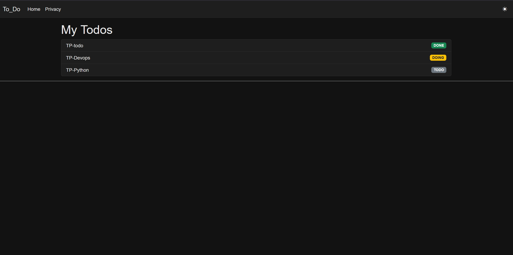

# Application To-Do – ASP.NET Core MVC

##  Présentation générale

Cette application est une **application To-Do simple** développée avec **ASP.NET Core MVC**.  
Elle permet de gérer une liste de tâches en utilisant **les sessions** (sans base de données), tout en respectant les **bonnes pratiques d’architecture**, la **séparation des responsabilités** et les **principes SOLID**.

L’objectif principal est pédagogique : comprendre comment structurer une application MVC propre, maintenable et évolutive.

---

##  Fonctionnalités principales

-  Ajouter une tâche (To-Do)
-  Afficher la liste des tâches
-  Gestion des statuts (TODO / DOING / DONE) avec couleurs
-  Thème clair / sombre (par session)
-  Persistance des données via **Session**
-  Journalisation des actions importantes (logs)
-  Architecture respectant la séparation des responsabilités

---

##  Architecture et séparation des responsabilités

L’application suit une architecture **MVC claire**, avec une séparation stricte des rôles :

###  Controllers
- Reçoivent les requêtes HTTP
- Gèrent la navigation et les redirections
- Ne contiennent **aucune logique métier**
- Déclenchent la journalisation via `ILogger`

###  Services
- Contiennent la **logique métier**
- Manipulent les données (ajout de tâches, gestion de listes)
- Indépendants de l’UI

Exemples :
- `TodoService` : gestion des tâches
- `SessionManagerService` : accès à la session

###  ViewModels
- Servent à échanger des données entre la vue et le contrôleur
- Contiennent la validation (DataAnnotations)
- Protègent les modèles internes

---
## Journalisation

L’application intègre un système de **journalisation** afin de tracer les actions importantes et faciliter le débogage.

La journalisation est implémentée en utilisant :
- `ILogger<T>` (abstraction de journalisation fournie par ASP.NET Core)
- **Serilog** pour la persistance des logs dans des fichiers et la console

---

###  Actions journalisées

Les événements suivants sont enregistrés :
- Accès aux pages principales
- Ajout d’une tâche (To-Do)
- Changement du thème (clair / sombre)
- Soumission invalide d’un formulaire
- Erreurs inattendues

Chaque action est enregistrée avec un **niveau de log approprié** :
- `Information` : comportement normal
- `Warning` : situation anormale sans blocage
- `Error` : erreur inattendue

###  Capture d’écran – Journalisation

##  Gestion du thème clair / sombre

Le thème est géré **par session**, sans base de données.

### Fonctionnement :
- Le choix du thème est stocké dans la session
- Un **filter global (`ThemeFilter`)** injecte le thème dans les vues
- Le layout applique dynamiquement une classe CSS (`light` / `dark`)

### Avantages :
- Thème persistant par utilisateur (session)
- Aucun code dupliqué dans les contrôleurs
- Bonne séparation entre logique et présentation

###  Capture d’écran – Thème sombre

